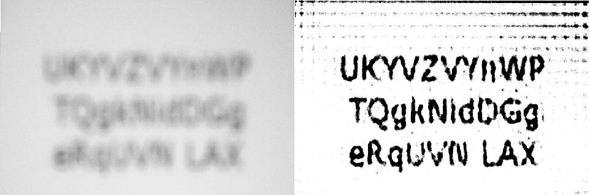
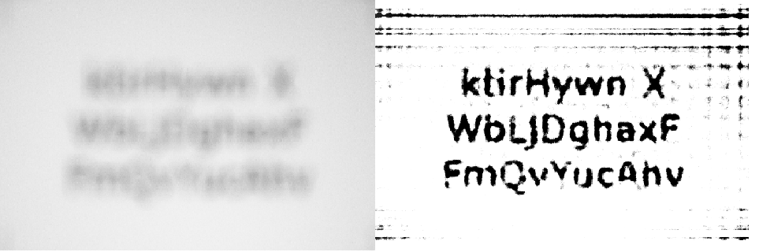

# UNICAMP/UFABC submission to the HDC2021 
## Team members
- João Rabello Alvim, BSc - UNICAMP j.rabello.alvim@outlook.com
- Kenji Nose Filho, PhD - UFABC kenji.nose@ufabc.edu.br
- Mauro Luis Brandão Junior, MSc - UNICAMP mrbrjr@gmail.com
- Renan Del Buono Brotto, MSc - UNICAMP renanbrotto@gmail.com
- Renato da Rocha Lopes, PHd - UNICAMP rlopes@unicamp.br
- Thomas Antônio Portugal Pereira Teixeira, BSc - UNICAMP thomasportugal5@gmail.com
- Victor Carneiro Lima, BSc - UNICAMP v157460@dac.unicamp.br

## Algorithm description

In order to compete on the Helsinki Deblur Challenge 2021 we propose a Regularization by Denoising [1] method. First we estimate the PSF with the given dot images at each step and then perform deconvolution using an inverse-problem frameworg with the RED (Regularization by Denoising) fixed point algorithm. The denoiser employed in this algorithm is a Wavelet denoiser (from Scipy) followed by a Soft Threshold, which is equivalent to performing a L1 norm regularization. In order to provide a better output for the OCR, we perform a contrast stretching followed by a simple threshold binarization.

## Instalation & execution instructions
1) Clone this project into your computer
2) Run from command line  "python3 deblur_script.py [input_path] [output_path] [level]

Observations:
- The input path and the file names must be in the same format as the examples provided by HDC2021 organization. It should have an "CAM01" folder with the original non-blurred images and a "CAM02" folder with the blurred images;
- The method will automatically save the deblurred images as .png files in the output path;
- In order to estimate the Optical Transfer Function, there must be a FocusStep_[level]\_PSF.tif file in both CAM01 and CAM02 folders.

Python libraries required:
- Pillow v8.0.1
- OpenCV v4.0.1
- NumPy v1.20.3
- SciPy v1.6.2
- scikit-image v0.18.1

## Examples

Step 7 deblurring

Step 9 deblurring

## References
[1] Romano, Y., Elad, M., & Milanfar, P. (2017). The little engine that could: Regularization by denoising (RED). SIAM Journal on Imaging Sciences, 10(4), 1804-1844.
